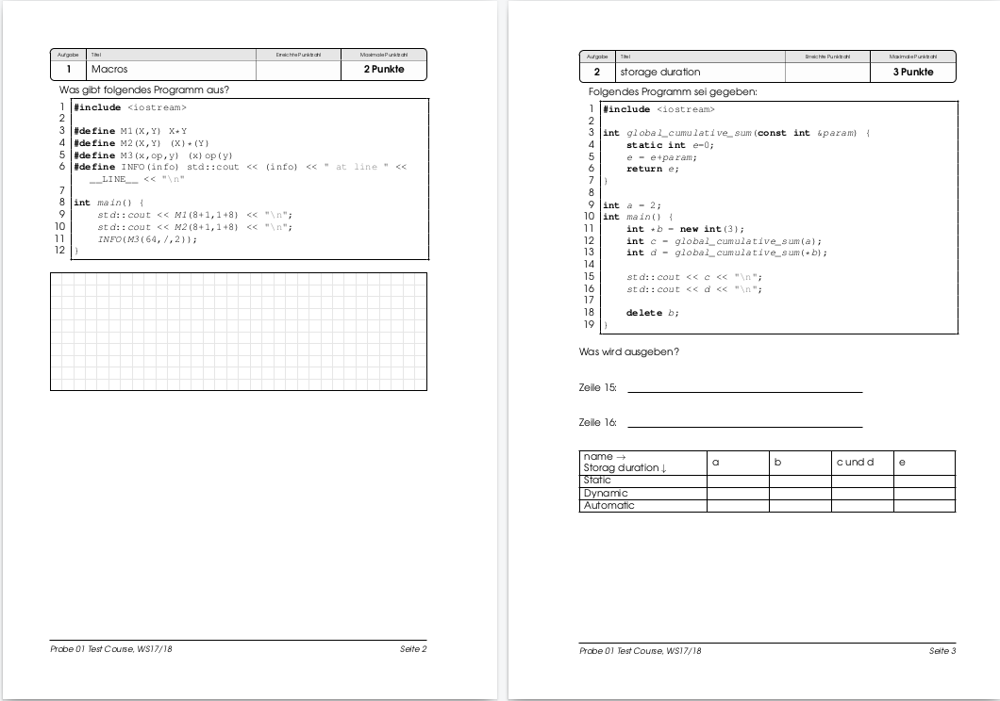
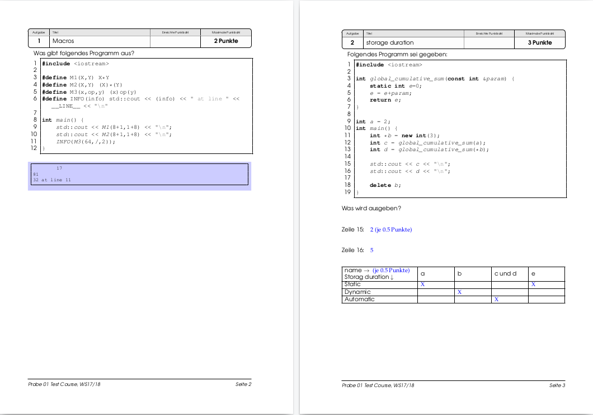

# examc
Exam DSL compiler (exam document generator).

## Purpose
This DSL is used to specify exams. From a single source
you can generate an exam and a solution document.

Example (some pages form an exam):

Example (some pages form an exam solution):

## Usage

    $ examc --help
    $ examc -I examples_en -e examples_en/Exam01.exam

Output: [src-gen/Exam01.pdf](doc/Exam01.pdf) and [src-gen/Exam01_solution.pdf](doc/Exam01_solution.pdf).

## Features

  * Collect exercises.
  * Assemble exercises in exams.
  * Single source for solution and exam.

## Grammar / Specification format

  * Exams are specified in *.exam files (grammar: see [Exam.tx](examc/Exam.tx)).
  * Exercises are specified in *.exercise files (Grammar: see [Exercise.tx](examc/Exercise.tx)).
  * Configurations (language adaptations) are stored in *.config files (Grammar: see [Config.tx](examc/Config.tx)).
  
File structure:

  * A library of exercises may contain many *.exercise files and exactly one *.config file.
  * An exam needs a library of exercises with one config to compile.

Examples:
  * A library is given in [examples/uebung](examples/uebung).
  * Some exams using this library are given in [examples](examples).

### Latex code

	LATEX
	-------
	\vspace*{3mm}
	What is printed?\\[10mm]
	Line 15: \examOrSolution{\underline{\hspace*{10cm}}}{2 (0.5 Points)}\\[10mm]
	Line 16: \examOrSolution{\underline{\hspace*{10cm}}}{5}\\[5mm]
	------	

### Images

    IMAGE { FILE: "img.jpg" WIDTH: 66percent }

### PlantUML (http://www.plantUML.com)

	PLANTUML
	----------------
	@startuml
	note "(2 Points)" as N1
	class P1a as "P1"
	class P1b as "P1"
	P1a <|-- P3
	P1b <|-- P4
	P2 <|-- P3
	P2 <|-- P4
	P3 <|-- P5
	P4 <|-- P5
	@enduml
	----------------

### C++ code

	CODE
	-------------
    // TODO: define "TypesAreEqual"
    int main() {
        static_assert( TypesAreEqual<double, float>::result 
                == false,  "static unit test");
        static_assert( TypesAreEqual<float, float>::result  
                == true,   "static unit test");
    }
	-------------

### ASCII text

	ASCII
	---------------------
    17
    81
    32 at line 11
	--------------------
	
## setup (developer)

Init virtual environment:

    $ virtualenv venv -p $(which python3)
    $ source ./venv/bin/activate
    $ pip install -r requirements_dev.txt 

Run the tests:

    $ py.test tests
    
Check code style:

    $ flake8

