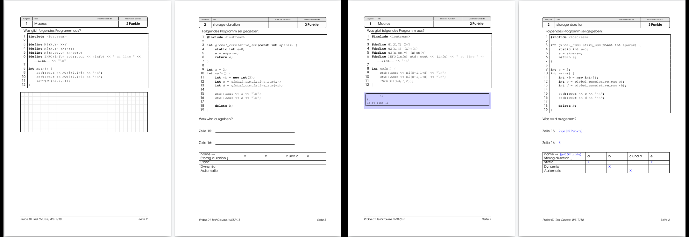

# examc
Exam DSL compiler (exam document generator).

## Purpose
This DSL is used to specify exams. From a single source
you can generate an exam and a solution document.

## Usage

    $ examc --help
    $ examc examples_en/Exam01.exam

Or (also executes LaTeX and opens the PDF):    
    
    $ examc -x examples_en/Exam01.exam

Output: [src-gen/Exam01.pdf](doc/Exam01.pdf) and [src-gen/Exam01_solution.pdf](doc/Exam01_solution.pdf).

Example (some pages from an exam and its solution):


## Features

  * Collect exercises.
  * Assemble exercises in exams.
  * Single source for solution and exam.

From the single source, examc generates:
  * An exam (PDF)
  * A solution (PDF) - hint: place correction hints in the solution
  * A CVS file with the individual exercises (name, #num, points; importable in Open Office Calc or Excel)

## Grammar / Specification format

  * Exams are specified in *.exam files (grammar: see [Exam.tx](examc/Exam.tx)).
  * Exercises are specified in *.exercise files (Grammar: see [Exercise.tx](examc/Exercise.tx)).
  * Configurations (language adaptations) are stored in *.config files (Grammar: see [Config.tx](examc/Config.tx)).
    See the example *.config files to see what you can specify.
  
**File structure**:

  * A library of exercises may contain many *.exercise files and exactly one *.config file.
  * An exam needs a library of exercises with one config to compile.

**Examples**:

  * German:
    * A library is given in [examples/uebung](examples/uebung).
    * Some exams using this library are given in [examples](examples).
  * English:
    * A library is given in [examples_en/exercises](examples_en/exercises).
    * One exam using this library is given in [examples_en/Exam01.exam](examples_en/Exam01.exam).

**Document control**:

All blocks of text (described in the following: LATEX, IMAGE, PLANTUML, ...)
can be specified to be shown in both generated documents ("BOTH", default),
in the exam version only ("EXAM"), or the solution document only ("SOLUTION").
To specify the target document, just add, e.g., "SOLUTION" after the block name.

The following example adds some free space in the 
exam document [src-gen/Exam01.pdf](doc/Exam01.pdf) 
and the solution text in the solution 
document [src-gen/Exam01_solution.pdf](doc/Exam01_solution.pdf).

	FREESPACE EXAM {HEIGHT:5cm}
	LATEX SOLUTION 
	----------------
	f gets a const reference to a P objekt and calls a
	non-const method of it (setX).
	----------------


### Latex code

	LATEX
	-------
	\vspace*{3mm}
	What is printed?\\[10mm]
	Line 15: \examOrSolution{\underline{\hspace*{10cm}}}{2 (0.5 Points)}\\[10mm]
	Line 16: \examOrSolution{\underline{\hspace*{10cm}}}{5}\\[5mm]
	------	

Within the latex text, you can use
 * ```\solution{TEXT}``` to include text only shown in the solution version (in blue).
 * ```\examOrSolution{EXAM-TEXT}{SOLUTION-TEXT}``` to specify text only for the exam/solution version.

### Images

    IMAGE { FILE: "img.jpg" WIDTH: 66percent }

### PlantUML (http://www.plantUML.com)

	PLANTUML
	----------------
	@startuml
	note "(2 Points)" as N1
	class P1a as "P1"
	class P1b as "P1"
	P1a <|-- P3
	P1b <|-- P4
	P2 <|-- P3
	P2 <|-- P4
	P3 <|-- P5
	P4 <|-- P5
	@enduml
	----------------

### C++ code

	CODE
	-------------
    // TODO: define "TypesAreEqual"
    int main() {
        static_assert( TypesAreEqual<double, float>::result 
                == false,  "static unit test");
        static_assert( TypesAreEqual<float, float>::result  
                == true,   "static unit test");
    }
	-------------

### ASCII text

	ASCII
	---------------------
    17
    81
    32 at line 11
	--------------------

## Free space

	FREESPACE {
		HEIGHT: 5cm
	}

	
## Setup (developer)

Init virtual environment:

    $ virtualenv venv -p $(which python3)
    $ source ./venv/bin/activate
    $ pip install -r requirements_dev.txt 

Note: you need the current master of textX to work with this DSL.

Run the tests:

    $ export PYTHONPATH=.
    $ py.test tests
    
Check code style:

    $ flake8

Run examc (without installing)

    $ export PYTHONPATH=.
    $ python examc/console.py --help
    $ python examc/console.py -x examples/Probe02.exam

## Setup (user)

work in progress (or: see .travis.yml)

You need LaTeX and PlantUML to compile the generated documents. Using Ubuntu I use

    $ sudo apt install texlive-latex-extra texlive-latex-recommended plantuml
